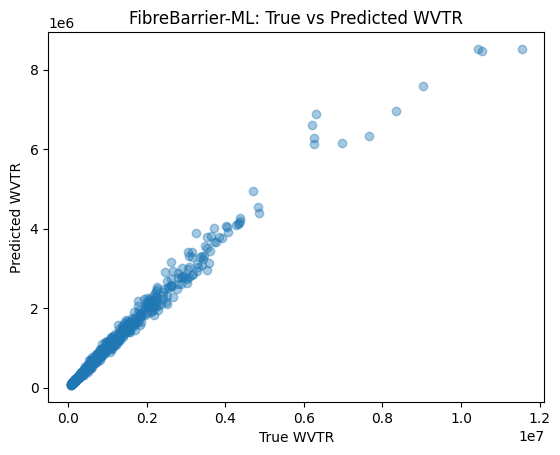

## FibreBarrier-ML
Physics-Informed WVTR Modelling + Machine Learning Surrogate for Fibre-Based Packaging Barriers

FibreBarrier-ML is a hybrid materials engineering + machine learning project that models the Water Vapour Transmission Rate (WVTR) of coated fibre-based packaging materials using:

A physics-inspired moisture-transport approximation

A synthetic dataset generation pipeline

A high-accuracy machine learning surrogate model

Visualization and performance analysis tools

This project demonstrates how physics-based assumptions can be combined with data-driven models to accelerate barrier coating development.

## 1. Project Motivation

Moisture barrier performance is crucial in:

moulded fibre packaging

paper-based materials

biodegradable polymer coatings

pharmaceutical packaging

Traditional WVTR testing requires specialized chambers and long conditioning times.
With FibreBarrier-ML, barrier engineers can:

perform rapid virtual WVTR predictions

explore design parameters (T, RH, coating weight)

understand sensitivity of WVTR to thickness and environmental conditions

use ML as a surrogate for fast screening

## 2. Physics-Inspired WVTR Generator

A custom Python function generates synthetic WVTR data using three physical concepts:

Humidity loading

WVTR increases with higher humidity levels.

Temperature effect

WVTR increases approximately linearly with temperature in typical packaging ranges.

Coating thickness effect

Thicker coatings reduce WVTR by limiting water vapour diffusion.

These relationships are combined into a simplified model to generate realistic WVTR trends without requiring laboratory testing.

A total of 3000 synthetic WVTR samples were generated within realistic industrial parameter ranges.

Dataset stored at:

data/wvtr_synthetic_data.csv

## 3. Machine Learning Surrogate Model

A Random Forest Regressor is trained to learn the nonlinear mapping:

(T, Relative Humidity, Coating Weight) → WVTR

Model Performance

R² = 0.973

Relative MAE ≈ 0.076 (~7.6%)

This means the model closely matches the behaviour of the physics-informed synthetic generator.

The trained surrogate can be used for:

rapid prediction

materials screening

optimisation studies

interactive design tools

## 4. Results
True vs Predicted WVTR

The strong diagonal trend indicates:

the ML model successfully captures WVTR behaviour

predictions generalize well across the parameter space

the surrogate can replace slow physical simulations for early-stage analysis

## 5. Repository Structure
FibreBarrier-ML/
│
├── data/
│   └── wvtr_synthetic_data.csv
│
├── notebooks/
│   ├── 01_generate_data.ipynb
│   └── 02_train_ml_model.ipynb
│
├── src/
│   └── physics_wvtr.py
│
├── figures/
│   └── wvtr_scatter.png
│
└── README.md

## 6. Key Features

✓ Physics-inspired synthetic dataset

✓ Full ML training pipeline

✓ High-accuracy Random Forest surrogate

✓ Clean, modular code structure

✓ Reproducible Jupyter notebooks

✓ Ready for research or industrial prototyping

## 7. Future Work

Multilayer barrier coating models

Integration with FEM moisture transport simulations

Parameter optimisation (Bayesian search)

Temperature-dependent diffusivity modelling

Transfer learning using real experimental WVTR datasets
